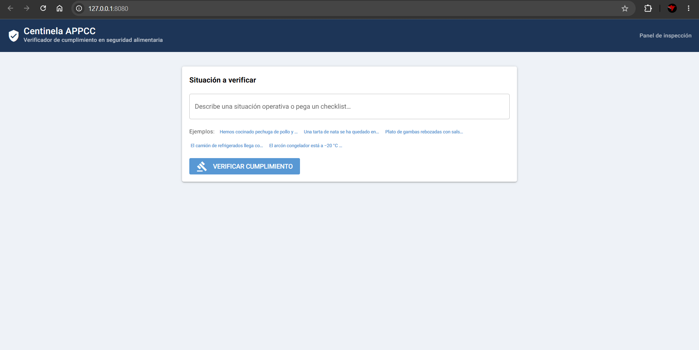
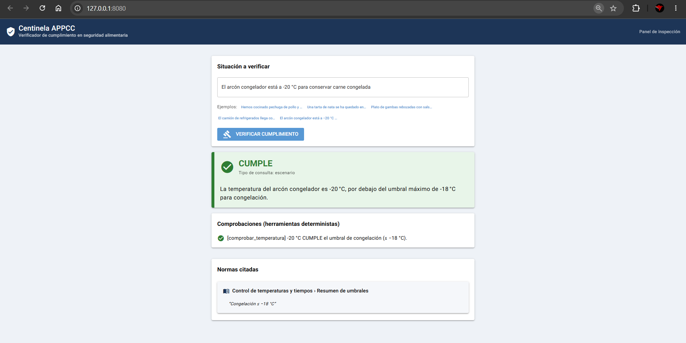
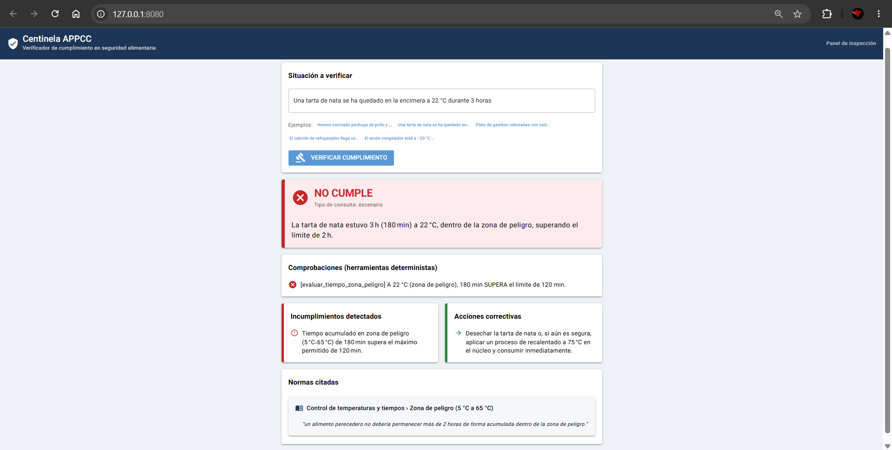
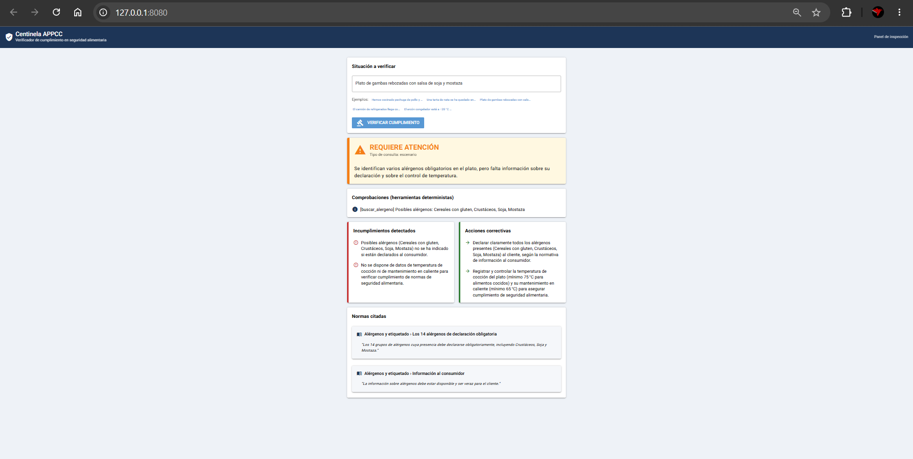

# Centinela APPCC — Verificador de cumplimiento en seguridad alimentaria con RAG

Centinela APPCC es un **verificador de cumplimiento** (no un chatbot): el usuario
describe una situación operativa de una cocina/industria alimentaria o rellena un
checklist, y el sistema emite un **veredicto estructurado** (🟢 cumple / 🟡 requiere
atención / 🔴 no cumple) con las **normas aplicables citadas** (indicando el documento
de origen), los **incumplimientos detectados** y las **acciones correctivas**.

> El razonamiento cualitativo (criterios, procedimientos, correcciones) proviene de un
> pipeline **RAG** sobre un corpus didáctico de seguridad alimentaria; las comprobaciones
> numéricas (temperaturas, tiempos en zona de peligro, alérgenos) las realizan **tools
> deterministas** que el LLM decide invocar. El veredicto se apoya en datos fiables, no en
> alucinación.

---

## Unidades del curso aplicadas

- **U1 — IA Generativa y LLMs:** un LLM (vía OpenRouter) evalúa la situación descrita y
  redacta el veredicto final. _(Justificación del modelo en «Decisiones técnicas».)_
- **U2 — Prompt Engineering:** system prompt que **obliga a citar la fuente** y **prohíbe
  inventar umbrales**; **few-shot** para clasificar el tipo de consulta (escenario libre vs.
  checklist y dominio implicado); **chain-of-thought** para razonar cadenas tiempo/temperatura.
- **U3 — Transformers y APIs:** acceso programático al LLM vía la API de OpenRouter
  (cliente OpenAI-compatible) con **timeouts, reintentos con backoff exponencial** y
  **validación de la salida estructurada**.
- **U4 — Agentes y function calling:** el LLM decide cuándo invocar **tools deterministas**
  (`comprobar_temperatura`, `evaluar_tiempo_zona_peligro`, `buscar_alergeno`) que devuelven
  resultados numéricos fiables sobre los que se construye el veredicto.
- **U5 — RAG y Bases Vectoriales:** ingesta del corpus → chunking → embeddings locales →
  base vectorial (ChromaDB) → recuperación semántica top-k de la normativa aplicable.
- **U6 — MCP (Model Context Protocol):** servidor MCP ([`src/mcp_server.py`](src/mcp_server.py))
  que expone dos tools, `buscar_normativa` y `verificar_cumplimiento`, para que cualquier
  cliente MCP (p. ej. Claude Desktop) use el verificador. Ver [`docs/mcp.md`](docs/mcp.md).

> **Cobertura: las 6 unidades del curso (U1–U6).**

---

## Arquitectura

```
                 ┌─────────────────────────────────────────────────────┐
  Entrada  ──▶   │  Escenario en lenguaje natural  /  Checklist         │
                 └───────────────────────────┬─────────────────────────┘
                                             │
                 ┌───────────────────────────▼─────────────────────────┐
   U5  RAG   ──▶ │  Recuperación semántica (Chroma, top-k) de la        │
                 │  normativa aplicable  →  parte CUALITATIVA            │
                 └───────────────────────────┬─────────────────────────┘
                                             │  contexto citado
                 ┌───────────────────────────▼─────────────────────────┐
 U1/U2/U3  ──▶   │  LLM (OpenRouter) razona y DECIDE invocar tools      │
                 └───────────────────────────┬─────────────────────────┘
                                             │  function calling
                 ┌───────────────────────────▼─────────────────────────┐
   U4 Tools  ──▶ │  Comprobaciones numéricas deterministas              │
                 │  (temperatura, tiempo en zona 5–65 °C, alérgenos)    │
                 └───────────────────────────┬─────────────────────────┘
                                             │
                 ┌───────────────────────────▼─────────────────────────┐
  Salida   ──▶   │  VEREDICTO ESTRUCTURADO (validado con Pydantic):     │
                 │  estado · normas citadas (con documento) ·           │
                 │  incumplimientos · acciones correctivas              │
                 └─────────────────────────────────────────────────────┘
```

_(Diagrama detallado y capturas en la sección «Capturas / Demo».)_

---

## Tecnologías utilizadas

- **Python 3.13** (entorno Windows + PowerShell).
- **OpenRouter** como pasarela al LLM (cliente `openai` OpenAI-compatible).
- **sentence-transformers** para embeddings **locales** (multilingüe, español).
- **ChromaDB** como base vectorial local persistente.
- **Pydantic** para validar el veredicto estructurado.
- **NiceGUI** para la interfaz tipo panel de inspección.
- **MCP (Model Context Protocol)** para exponer el verificador como servidor de tools.

---

## Instalación y configuración

> Requiere **Python 3.13** (las dependencias de embeddings/vector store no funcionan en
> versiones antiguas). Comandos para **Windows + PowerShell**.

```powershell
# 1) Clonar el repositorio
git clone https://github.com/Serter998/sergio-rasillo-ml2-practica-libre.git
cd sergio-rasillo-ml2-practica-libre

# 2) Crear y activar el entorno virtual
py -3.13 -m venv .venv
.\.venv\Scripts\Activate.ps1

# 3) Instalar dependencias
pip install -r requirements.txt

# 4) Configurar la clave (solo necesaria a partir de la Fase 2)
copy .env.example .env
#   …y edita .env para poner tu OPENROUTER_API_KEY
```

> La app **no se rompe** si arrancas sin `OPENROUTER_API_KEY`: muestra un aviso claro
> indicando que falta la clave y dónde ponerla. El corpus, la ingesta y el retrieval
> (Fases 0–1) son ejecutables **sin clave**.

---

## Uso

```powershell
# Construir la base vectorial a partir del corpus (no requiere clave)
python -m src.ingesta

# Probar la recuperación semántica sin LLM (no requiere clave)
python scripts\probar_retrieval.py "carne de pollo cocinada a 60 grados en el centro"

# Ejecutar el verificador por consola (requiere OPENROUTER_API_KEY)
python -m src.cli

# Lanzar la interfaz web tipo panel de inspección (requiere OPENROUTER_API_KEY)
python -m src.app          # abre http://localhost:8080

# Lanzar el servidor MCP (U6) para clientes como Claude Desktop (ver docs/mcp.md)
python -m src.mcp_server
```

**Ejemplo de salida por consola:**

```text
$ python -m src.cli "Hemos cocinado pollo y el termómetro marca 60 °C en el centro"

══════════════════════════════════════════════════════════════════════
  VEREDICTO:  🔴 NO CUMPLE
══════════════════════════════════════════════════════════════════════
▶ Resumen
  La pechuga de pollo alcanzó solo 60 °C, por debajo del mínimo de 75 °C.
▶ Comprobaciones (herramientas deterministas)
  ✗ [comprobar_temperatura] 60 °C NO CUMPLE el umbral de cocinado en núcleo (≥ 75 °C).
▶ Acciones correctivas
  → Continuar la cocción hasta que el centro alcance al menos 75 °C antes de servir.
▶ Normas citadas
  «Control de temperaturas y tiempos» › Cocinado
```

---

## Despliegue

La app incluye un [`Dockerfile`](Dockerfile) y un [`render.yaml`](render.yaml) listos para
desplegar en Render o Koyeb. La base vectorial se construye dentro de la imagen. Instrucciones
paso a paso en [`docs/despliegue.md`](docs/despliegue.md).

> URL pública del despliegue: _(añadir tras desplegar)_

---

## Capturas / Demo

**Panel de inspección** (estado inicial, sin chat):



**Veredicto que CUMPLE** (congelador a −20 °C):



**Veredicto que NO CUMPLE** con incumplimientos y acciones correctivas (tarta de nata 3 h a 22 °C):



**Normas citadas** con su documento de origen (alérgenos de un plato):



---

## Decisiones técnicas

- **Modelo LLM:** `openai/gpt-oss-120b:free` vía OpenRouter. Es **gratuito** (sin coste ni
  tarjeta), tiene buen soporte de *function calling* —imprescindible para U4— y responde con
  solvencia en español. Se validó en la práctica que invoca correctamente las tres tools
  deterministas. Como el *tier* gratuito impone límites de tasa, el cliente añade reintentos
  con backoff exponencial. Alternativas también gratuitas y configurables en `.env`:
  `openai/gpt-oss-20b:free`, `google/gemini-2.0-flash-exp:free`.
- **Temperatura:** `0.1` — dominio de cumplimiento ⇒ se prioriza la consistencia y se
  minimiza la alucinación; no se usa 0 para permitir una redacción natural del veredicto.
- **Embeddings locales** (no se usa OpenRouter para embeddings, que no ofrece un endpoint
  fiable): `intfloat/multilingual-e5-base`. Buen rendimiento multilingüe en español y corre
  en CPU sin coste. Se aplican los prefijos `query:`/`passage:` que el modelo espera.
- **Vector store:** ChromaDB — guarda metadatos (documento de origen, dominio, sección)
  junto al vector, imprescindible para **citar la fuente** en el veredicto. Distancia coseno
  sobre embeddings normalizados.
- **Chunking:** troceado *consciente de encabezados* (cada sección `##` es una unidad),
  con subdivisión en ventanas de **600 caracteres** y **100 de solape** para las secciones
  largas. Así cada umbral/criterio queda íntegro y la cita sale limpia (44 chunks en total).
- **k = 4** en la recuperación: suficiente para traer 2-4 criterios aplicables sin meter
  ruido. En las pruebas, las consultas relevantes recuperan los fragmentos correctos con
  similitudes de 0.82–0.89.
- **Dificultades encontradas y cómo se resolvieron:**
  - *Salida en consola de Windows:* la consola usa `cp1252` y reventaba al imprimir `≤`, `°`
    o emojis (`UnicodeEncodeError`). Solución: forzar `sys.stdout.reconfigure(encoding="utf-8")`
    en los puntos de entrada.
  - *Detección de alérgenos con plurales:* el matcher con `\bgamba\b` no reconocía «gambas».
    Solución: regex con sufijo plural opcional (`\b…s?\b`) y variantes de género.
  - *Elección de la tool:* el modelo a veces no invocaba `buscar_alergeno` o confundía
    «cocinado» (≥75 °C) con «mantenimiento en caliente» (≥65 °C). Solución: reforzar el system
    prompt para obligar al uso de tools y afinar las descripciones de los parámetros.
  - *JSON del modelo no siempre limpio:* se extrae el primer objeto JSON de forma tolerante,
    con un reintento de reparación y, en último caso, degradación a «requiere_atención» sin
    romper la aplicación.
  - *Límites de tasa del modelo gratuito:* reintentos con backoff exponencial en el cliente.

### Apoyo de herramientas de IA

El proyecto se desarrolló mediante **programación asistida con Claude (Anthropic), usando
Claude Code**. La asistencia de IA se empleó para generar el grueso del código de los módulos
(`ingesta`, `rag`, `tools`, `llm`, `veredicto`, `cli`, `app`), el corpus didáctico y el
borrador del README. El autor definió el **concepto y la arquitectura**, tomó las
**decisiones técnicas** (modelo, temperatura, embeddings, chunking, *k*, stack sin LangChain),
**revisó y validó cada fase** probando escenarios reales, e introdujo **ajustes manuales**:
corrección de los bugs descritos arriba, refinamiento de prompts y de umbrales, y verificación
de que las citas y los veredictos eran correctos. El historial de commits refleja el trabajo
progresivo por fases, no un único bloque generado.

---

## Posibles mejoras

1. **Modo checklist estructurado:** un formulario con campos numéricos por punto de control
   (temperaturas, tiempos) que alimente las tools directamente, sin depender de que el LLM
   extraiga los números del texto libre.
2. **Recuperación híbrida y filtrada por dominio:** combinar búsqueda léxica (BM25) con la
   vectorial y filtrar por el dominio detectado en la clasificación, para citas aún más
   precisas sobre un corpus mayor.
3. **Exportar el veredicto a un registro APPCC en PDF** con fecha y firma, para trazabilidad
   documental de las verificaciones.
4. **Conjunto de evaluación automática:** una batería de escenarios con su veredicto esperado
   para medir objetivamente la precisión del sistema ante cambios de modelo o de prompts.

---

## Autor

- **Sergio Rasillo Flores**

---

> **Aviso:** el corpus incluido es **contenido didáctico de elaboración propia** basado en
> criterios estándar y públicos del sector. **No constituye normativa oficial** ni reproduce
> ningún reglamento ni material de empresa alguna.
